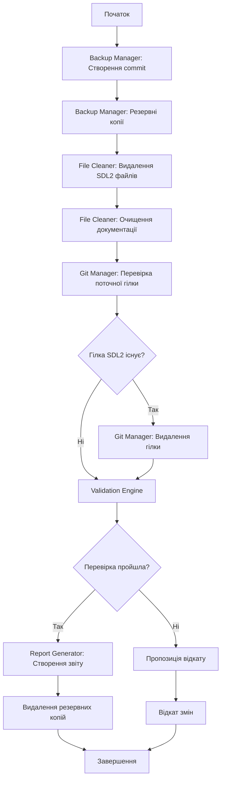

# Design Document: SDL2 Cleanup System

## Overview

Цей документ описує технічний дизайн системи для безпечного очищення проекту "Punic Wars: Castra" від застарілих файлів та документації, пов'язаних з невдалою міграцією на SDL2. Система забезпечує автоматизоване видалення SDL2-специфічних файлів, оновлення документації, видалення git гілок та перевірку працездатності проекту після очищення.

### Goals

- Видалити всі SDL2-специфічні файли документації (SDL2_MIGRATION_TODO.md, QUICK_START_SDL2.md)
- Очистити згадки про SDL2 з існуючої документації
- Видалити SDL2 гілку з локального та віддаленого репозиторію
- Забезпечити збереження працездатності проекту на Raylib
- Створити детальний звіт про виконані операції
- Забезпечити можливість відкату змін у разі проблем

### Non-Goals

- Модифікація робочого коду гри (тільки документація)
- Видалення історичних записів про розробку
- Зміна функціональності гри
- Оптимізація існуючого коду

## Architecture

### High-Level Design

Система складається з п'яти основних компонентів, які виконуються послідовно:

```
┌─────────────────────────────────────────────────────────────┐
│                    Cleanup Orchestrator                      │
│                  (Координує всі операції)                    │
└──────────────────────┬──────────────────────────────────────┘
                       │
         ┌─────────────┼─────────────┬─────────────┐
         │             │             │             │
         ▼             ▼             ▼             ▼
┌────────────┐  ┌────────────┐  ┌────────────┐  ┌────────────┐
│   Backup   │  │    File    │  │    Git     │  │ Validation │
│  Manager   │  │  Cleaner   │  │  Manager   │  │  Engine    │
└────────────┘  └────────────┘  └────────────┘  └────────────┘
         │             │             │             │
         └─────────────┴─────────────┴─────────────┘
                       │
                       ▼
              ┌────────────────┐
              │     Report     │
              │   Generator    │
              └────────────────┘
```

### Component Responsibilities

1. **Backup Manager**: Створює git commit та резервні копії файлів перед модифікацією
2. **File Cleaner**: Видаляє SDL2 файли та очищає згадки в документації
3. **Git Manager**: Керує видаленням SDL2 гілки
4. **Validation Engine**: Перевіряє працездатність проекту після очищення
5. **Report Generator**: Створює детальний звіт про виконані операції

### Execution Flow



## Components and Interfaces

### 1. Backup Manager

**Responsibility**: Забезпечує можливість відкату змін

**Interface**:
```python
class BackupManager:
    def create_safety_commit(self) -> str:
        """Створює git commit з поточним станом проекту
        
        Returns:
            commit_hash: SHA хеш створеного commit
        """
        pass
    
    def create_file_backups(self, files: List[str]) -> str:
        """Створює резервні копії файлів у тимчасовій директорії
        
        Args:
            files: Список шляхів до файлів для резервування
            
        Returns:
            backup_dir: Шлях до директорії з резервними копіями
        """
        pass
    
    def cleanup_backups(self, backup_dir: str) -> None:
        """Видаляє тимчасові резервні копії після підтвердження
        
        Args:
            backup_dir: Шлях до директорії з резервними копіями
        """
        pass
    
    def rollback_changes(self, commit_hash: str, backup_dir: str) -> None:
        """Відкочує зміни до попереднього стану
        
        Args:
            commit_hash: SHA хеш commit для відкату
            backup_dir: Шлях до директорії з резервними копіями
        """
        pass
```

### 2. File Cleaner

**Responsibility**: Видаляє SDL2 файли та очищає документацію

**Interface**:
```python
class FileCleaner:
    def find_sdl2_references(self, search_paths: List[str]) -> Dict[str, List[str]]:
        """Знаходить всі згадки про SDL2 в файлах
        
        Args:
            search_paths: Список директорій для пошуку
            
        Returns:
            references: Словник {файл: [рядки зі згадками SDL2]}
        """
        pass
    
    def delete_sdl2_files(self) -> List[str]:
        """Видаляє SDL2-специфічні файли документації
        
        Returns:
            deleted_files: Список видалених файлів
        """
        pass
    
    def clean_documentation(self, files: List[str]) -> Dict[str, str]:
        """Очищає згадки про SDL2 з документації
        
        Args:
            files: Список файлів для очищення
            
        Returns:
            modifications: Словник {файл: опис змін}
        """
        pass
    
    def find_legacy_files(self, directory: str) -> List[Dict[str, str]]:
        """Знаходить потенційно застарілі файли
        
        Args:
            directory: Директорія для пошуку
            
        Returns:
            legacy_files: Список словників з інформацією про файли
        """
        pass
```

### 3. Git Manager

**Responsibility**: Керує git операціями

**Interface**:
```python
class GitManager:
    def get_current_branch(self) -> str:
        """Отримує назву поточної активної гілки
        
        Returns:
            branch_name: Назва поточної гілки
        """
        pass
    
    def branch_exists(self, branch_name: str, remote: bool = False) -> bool:
        """Перевіряє існування гілки
        
        Args:
            branch_name: Назва гілки
            remote: Перевіряти віддалену гілку
            
        Returns:
            exists: True якщо гілка існує
        """
        pass
    
    def delete_local_branch(self, branch_name: str) -> bool:
        """Видаляє локальну гілку
        
        Args:
            branch_name: Назва гілки для видалення
            
        Returns:
            success: True якщо операція успішна
        """
        pass
    
    def delete_remote_branch(self, branch_name: str) -> bool:
        """Видаляє віддалену гілку
        
        Args:
            branch_name: Назва гілки для видалення
            
        Returns:
            success: True якщо операція успішна
        """
        pass
    
    def verify_branch_integrity(self, branch_name: str) -> str:
        """Перевіряє цілісність гілки
        
        Args:
            branch_name: Назва гілки для перевірки
            
        Returns:
            commit_hash: SHA хеш останнього commit
        """
        pass
```

### 4. Validation Engine

**Responsibility**: Перевіряє працездатність проекту після очищення

**Interface**:
```python
class ValidationEngine:
    def verify_critical_files(self) -> Tuple[bool, List[str]]:
        """Перевіряє наявність всіх критичних файлів
        
        Returns:
            (success, missing_files): Результат перевірки та список відсутніх файлів
        """
        pass
    
    def check_sdl2_includes(self, directory: str) -> Dict[str, List[str]]:
        """Перевіряє відсутність SDL2 включень у коді
        
        Args:
            directory: Директорія для перевірки
            
        Returns:
            includes: Словник {файл: [знайдені включення SDL2]}
        """
        pass
    
    def test_compilation(self, script_path: str) -> Tuple[bool, str]:
        """Тестує компіляцію проекту
        
        Args:
            script_path: Шлях до скрипта компіляції
            
        Returns:
            (success, output): Результат компіляції та вивід
        """
        pass
    
    def run_validation_suite(self) -> Dict[str, bool]:
        """Виконує повний набір перевірок
        
        Returns:
            results: Словник {назва_перевірки: результат}
        """
        pass
```

### 5. Report Generator

**Responsibility**: Створює детальний звіт про операції

**Interface**:
```python
class ReportGenerator:
    def add_deleted_files(self, files: List[str]) -> None:
        """Додає інформацію про видалені файли
        
        Args:
            files: Список видалених файлів
        """
        pass
    
    def add_modified_files(self, modifications: Dict[str, str]) -> None:
        """Додає інформацію про модифіковані файли
        
        Args:
            modifications: Словник {файл: опис змін}
        """
        pass
    
    def add_git_operations(self, operations: List[str]) -> None:
        """Додає інформацію про git операції
        
        Args:
            operations: Список виконаних git операцій
        """
        pass
    
    def add_validation_results(self, results: Dict[str, bool]) -> None:
        """Додає результати перевірки працездатності
        
        Args:
            results: Словник {назва_перевірки: результат}
        """
        pass
    
    def generate_report(self, output_path: str) -> None:
        """Генерує та зберігає звіт
        
        Args:
            output_path: Шлях для збереження звіту
        """
        pass
```

### 6. Cleanup Orchestrator

**Responsibility**: Координує виконання всіх операцій

**Interface**:
```python
class CleanupOrchestrator:
    def __init__(self):
        self.backup_manager = BackupManager()
        self.file_cleaner = FileCleaner()
        self.git_manager = GitManager()
        self.validation_engine = ValidationEngine()
        self.report_generator = ReportGenerator()
    
    def execute_cleanup(self) -> bool:
        """Виконує повний цикл очищення проекту
        
        Returns:
            success: True якщо очищення успішне
        """
        pass
```

## Data Models

### CleanupConfig

Конфігурація для операції очищення:

```python
@dataclass
class CleanupConfig:
    # Файли для видалення
    files_to_delete: List[str] = field(default_factory=lambda: [
        "cpp/SDL2_MIGRATION_TODO.md",
        "cpp/QUICK_START_SDL2.md"
    ])
    
    # Файли для очищення від SDL2 згадок
    files_to_clean: List[str] = field(default_factory=lambda: [
        "ТЗ від грока",
        "Переписка з грок вихідні дані.txt",
        "cpp/README.md",
        "SESSION_CONTEXT.md"
    ])
    
    # Файли, які мають залишитися незмінними
    protected_files: List[str] = field(default_factory=lambda: [
        "cpp/SETUP.md",
        "cpp/src/main.cpp",
        "cpp/compile.bat"
    ])
    
    # Критичні файли для перевірки
    critical_files: List[str] = field(default_factory=lambda: [
        "cpp/src/main.cpp",
        "cpp/compile.bat",
        "cpp/README.md",
        "cpp/SETUP.md"
    ])
    
    # Директорії для пошуку
    search_directories: List[str] = field(default_factory=lambda: [
        "cpp/",
        "."
    ])
    
    # Git гілка для видалення
    branch_to_delete: str = "SDL2"
    
    # Шлях для збереження звіту
    report_path: str = ".kiro/specs/project-cleanup-sdl2-removal/cleanup_report.md"
    
    # Директорія для резервних копій
    backup_directory: str = ".kiro/specs/project-cleanup-sdl2-removal/backups"
```

### CleanupResult

Результат операції очищення:

```python
@dataclass
class CleanupResult:
    success: bool
    commit_hash: str
    deleted_files: List[str]
    modified_files: Dict[str, str]
    git_operations: List[str]
    validation_results: Dict[str, bool]
    errors: List[str]
    warnings: List[str]
    backup_directory: str
    report_path: str
```

### FileReference

Інформація про згадку SDL2 у файлі:

```python
@dataclass
class FileReference:
    file_path: str
    line_number: int
    line_content: str
    context_before: List[str]
    context_after: List[str]
    is_historical: bool  # Чи є це частиною історичного контексту
```

### ValidationResult

Результат перевірки працездатності:

```python
@dataclass
class ValidationResult:
    check_name: str
    passed: bool
    message: str
    details: Optional[Dict[str, Any]] = None
```

## Correctness Properties

*Властивість (property) - це характеристика або поведінка, яка має виконуватися для всіх валідних виконань системи. Властивості служать мостом між специфікаціями, зрозумілими людині, та гарантіями коректності, які можна перевірити машинно.*

### Property 1: Збереження незмінних файлів

*For any* файл, який не є SDL2-специфічним та не міститься в списку files_to_clean, після виконання операції очищення вміст файлу має залишитися ідентичним вмісту до операції (перевірка через хеш-суму).

**Validates: Requirements 1.3, 1.4, 3.4**

### Property 2: Повнота пошуку SDL2 згадок

*For any* файл у search_directories, якщо файл містить рядок "SDL2", "sdl2", "SDL", або "sdl" (case-insensitive), то метод find_sdl2_references має включити цей файл у результати пошуку.

**Validates: Requirements 2.1, 5.2, 5.4**

### Property 3: Резервне копіювання перед модифікацією

*For any* файл, який буде модифіковано або видалено, перед виконанням операції має існувати резервна копія цього файлу в backup_directory, і вміст резервної копії має бути ідентичним оригіналу.

**Validates: Requirements 2.5, 8.2**

### Property 4: Відсутність SDL2 включень після очищення

*For any* файл з розширенням .cpp або .h у директорії cpp/src/, після виконання очищення файл не має містити рядків виду `#include <SDL2/...>` або `#include "SDL2/..."`.

**Validates: Requirements 4.1, 4.4**

### Property 5: Повнота звіту

*For any* операція (видалення файлу, модифікація файлу, git операція), виконана під час очищення, інформація про цю операцію має бути присутня у згенерованому звіті.

**Validates: Requirements 7.1, 7.2**

## Error Handling

### Error Categories

1. **File System Errors**
   - Файл не знайдено
   - Недостатньо прав доступу
   - Диск заповнений

2. **Git Errors**
   - Поточна гілка є SDL2
   - Гілка не існує
   - Конфлікти при видаленні
   - Проблеми з віддаленим репозиторієм

3. **Validation Errors**
   - Критичні файли відсутні
   - Знайдено SDL2 включення після очищення
   - Компіляція не вдалася

4. **Backup Errors**
   - Не вдалося створити commit
   - Не вдалося створити резервні копії

### Error Handling Strategy

```python
class CleanupError(Exception):
    """Базовий клас для помилок очищення"""
    pass

class FileSystemError(CleanupError):
    """Помилки файлової системи"""
    pass

class GitError(CleanupError):
    """Помилки git операцій"""
    pass

class ValidationError(CleanupError):
    """Помилки перевірки"""
    pass

class BackupError(CleanupError):
    """Помилки резервного копіювання"""
    pass
```

### Recovery Procedures

1. **При помилці файлової системи**:
   - Логувати помилку
   - Пропустити файл та продовжити
   - Додати попередження у звіт

2. **При помилці git**:
   - Якщо поточна гілка SDL2 - зупинити виконання
   - Якщо гілка не існує - продовжити без помилки
   - При інших помилках - запропонувати ручне втручання

3. **При помилці валідації**:
   - Зупинити виконання
   - Запропонувати відкат змін
   - Створити детальний звіт про проблему

4. **При помилці резервного копіювання**:
   - Зупинити виконання негайно
   - Не виконувати жодних модифікацій
   - Повідомити користувача

### Rollback Mechanism

```python
def safe_execute_with_rollback(operation: Callable) -> CleanupResult:
    """Виконує операцію з можливістю відкату
    
    Args:
        operation: Функція для виконання
        
    Returns:
        result: Результат операції
    """
    # Створити safety commit
    commit_hash = backup_manager.create_safety_commit()
    
    # Створити резервні копії
    backup_dir = backup_manager.create_file_backups(files_to_modify)
    
    try:
        # Виконати операцію
        result = operation()
        
        # Перевірити результат
        if not validation_engine.run_validation_suite():
            raise ValidationError("Validation failed after cleanup")
        
        return result
        
    except Exception as e:
        # Запропонувати відкат
        if user_confirms_rollback():
            backup_manager.rollback_changes(commit_hash, backup_dir)
        raise
    
    finally:
        # Очистити резервні копії після підтвердження
        if result.success and user_confirms_cleanup():
            backup_manager.cleanup_backups(backup_dir)
```

## Testing Strategy

### Dual Testing Approach

Система тестування використовує два комплементарні підходи:

1. **Unit Tests**: Перевіряють конкретні приклади, edge cases та умови помилок
2. **Property-Based Tests**: Перевіряють універсальні властивості для всіх можливих входів

Обидва типи тестів необхідні для повного покриття: unit тести виявляють конкретні баги, property тести перевіряють загальну коректність.

### Property-Based Testing

Для property-based тестування використовуємо бібліотеку **Hypothesis** (Python).

**Конфігурація**:
- Мінімум 100 ітерацій на кожен property тест
- Кожен тест має тег з посиланням на властивість у design документі
- Формат тегу: `# Feature: project-cleanup-sdl2-removal, Property {number}: {property_text}`

**Property Tests**:

```python
from hypothesis import given, strategies as st
import hypothesis

# Feature: project-cleanup-sdl2-removal, Property 1: Збереження незмінних файлів
@given(st.lists(st.text(min_size=1), min_size=1))
@hypothesis.settings(max_examples=100)
def test_property_unchanged_files_preserved(file_contents):
    """For any файл, який не є SDL2-специфічним, вміст має залишитися незмінним"""
    # Створити тестові файли
    # Виконати очищення
    # Перевірити хеш-суми
    pass

# Feature: project-cleanup-sdl2-removal, Property 2: Повнота пошуку SDL2 згадок
@given(st.text(min_size=1))
@hypothesis.settings(max_examples=100)
def test_property_sdl2_search_completeness(file_content):
    """For any файл, що містить SDL2 згадки, пошук має їх знайти"""
    if any(term in file_content.lower() for term in ["sdl2", "sdl"]):
        results = file_cleaner.find_sdl2_references([test_file])
        assert test_file in results
    pass

# Feature: project-cleanup-sdl2-removal, Property 3: Резервне копіювання
@given(st.lists(st.text(min_size=1), min_size=1))
@hypothesis.settings(max_examples=100)
def test_property_backup_before_modification(files_to_modify):
    """For any файл для модифікації, має існувати резервна копія"""
    backup_dir = backup_manager.create_file_backups(files_to_modify)
    for file in files_to_modify:
        backup_path = os.path.join(backup_dir, file)
        assert os.path.exists(backup_path)
        assert filecmp.cmp(file, backup_path)
    pass

# Feature: project-cleanup-sdl2-removal, Property 4: Відсутність SDL2 включень
@given(st.text(min_size=1))
@hypothesis.settings(max_examples=100)
def test_property_no_sdl2_includes_after_cleanup(file_content):
    """For any файл після очищення, не має містити SDL2 включень"""
    # Виконати очищення
    # Перевірити відсутність #include <SDL2/...>
    pass

# Feature: project-cleanup-sdl2-removal, Property 5: Повнота звіту
@given(st.lists(st.text(min_size=1), min_size=1))
@hypothesis.settings(max_examples=100)
def test_property_report_completeness(operations):
    """For any операція, інформація має бути у звіті"""
    # Виконати операції
    # Згенерувати звіт
    # Перевірити наявність кожної операції у звіті
    pass
```

### Unit Testing

**Unit тести** фокусуються на конкретних прикладах та edge cases:

```python
def test_delete_sdl2_migration_todo():
    """Перевірка видалення cpp/SDL2_MIGRATION_TODO.md"""
    # Validates: Requirements 1.1
    pass

def test_delete_quick_start_sdl2():
    """Перевірка видалення cpp/QUICK_START_SDL2.md"""
    # Validates: Requirements 1.2
    pass

def test_clean_tz_vid_groka():
    """Перевірка очищення файлу 'ТЗ від грока'"""
    # Validates: Requirements 2.2
    pass

def test_current_branch_not_sdl2():
    """Перевірка, що поточна гілка не SDL2"""
    # Validates: Requirements 3.1
    pass

def test_delete_local_sdl2_branch():
    """Перевірка видалення локальної SDL2 гілки"""
    # Validates: Requirements 3.2
    pass

def test_branch_not_exists_no_error():
    """Edge case: гілка SDL2 не існує - без помилки"""
    # Validates: Requirements 3.5
    pass

def test_main_cpp_no_sdl2_includes():
    """Перевірка відсутності SDL2 включень у main.cpp"""
    # Validates: Requirements 4.2
    pass

def test_compile_bat_works():
    """Перевірка працездатності compile.bat"""
    # Validates: Requirements 4.3
    pass

def test_create_cleanup_report():
    """Перевірка створення звіту"""
    # Validates: Requirements 4.5
    pass

def test_legacy_files_list_created():
    """Перевірка створення списку застарілих файлів"""
    # Validates: Requirements 5.3
    pass

def test_readme_sdl2_check():
    """Перевірка cpp/README.md на SDL2 згадки"""
    # Validates: Requirements 6.1
    pass

def test_readme_sdl2_removal():
    """Перевірка видалення SDL2 згадок з README.md"""
    # Validates: Requirements 6.2
    pass

def test_session_context_update():
    """Перевірка оновлення SESSION_CONTEXT.md"""
    # Validates: Requirements 6.4
    pass

def test_report_deleted_files():
    """Перевірка наявності видалених файлів у звіті"""
    # Validates: Requirements 7.3
    pass

def test_report_validation_results():
    """Перевірка наявності результатів валідації у звіті"""
    # Validates: Requirements 7.4
    pass

def test_report_saved_to_correct_location():
    """Перевірка збереження звіту у правильній директорії"""
    # Validates: Requirements 7.5
    pass

def test_safety_commit_created():
    """Перевірка створення safety commit"""
    # Validates: Requirements 8.1
    pass

def test_backups_in_temp_directory():
    """Перевірка збереження резервних копій у тимчасовій директорії"""
    # Validates: Requirements 8.3
    pass

def test_rollback_on_error():
    """Edge case: відкат при помилці"""
    # Validates: Requirements 8.4
    pass

def test_cleanup_backups_after_success():
    """Перевірка видалення резервних копій після успіху"""
    # Validates: Requirements 8.5
    pass
```

### Integration Testing

```python
def test_full_cleanup_workflow():
    """Інтеграційний тест повного циклу очищення"""
    orchestrator = CleanupOrchestrator()
    result = orchestrator.execute_cleanup()
    
    assert result.success
    assert len(result.deleted_files) >= 2
    assert "cpp/SDL2_MIGRATION_TODO.md" in result.deleted_files
    assert "cpp/QUICK_START_SDL2.md" in result.deleted_files
    assert result.validation_results["critical_files"] == True
    assert result.validation_results["no_sdl2_includes"] == True
    assert os.path.exists(result.report_path)
```

### Test Coverage Goals

- Unit test coverage: мінімум 80%
- Property test coverage: всі 5 correctness properties
- Integration test coverage: повний workflow
- Edge cases: всі ідентифіковані edge cases з requirements

### Manual Testing Checklist

Після автоматичного тестування виконати ручну перевірку:

1. ✓ Гра компілюється без помилок
2. ✓ Гра запускається та працює коректно
3. ✓ Документація не містить SDL2 згадок (окрім історичних)
4. ✓ Git репозиторій не містить SDL2 гілки
5. ✓ Звіт містить всю необхідну інформацію
6. ✓ Резервні копії видалені після підтвердження
